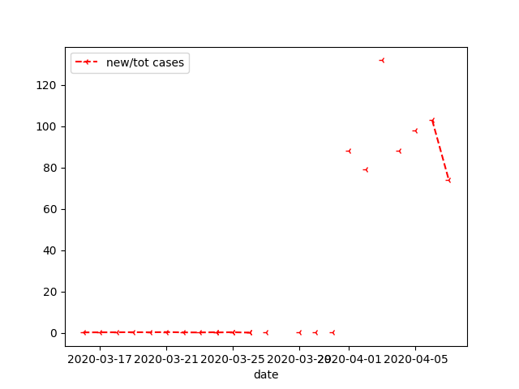

# Tracking the evolution of Covid-19 in Argentina using data from the Health-ministry and other sources like Google News

## Required packages

>-  pandas
>-  numpy
>-  matplotlib and seaborn :: for plotting
>-  os
>-  requests :: to get url data
>-  bs4 :: to work with json files
>-  PyPDF2 :: to read PDFs
>-  re :: for regular expressions
>-  news-api, install like: sudo pip3 install newsapi-python

## Workflow

### 'trackingCov19.py'

    This is a web scrapper that gets the PDF files from the official
    Health-ministry.

### 'analys_trackCov19.py'
    
    This is a data analysis script to read the pdfs and stract relevant information.
    In addition it plots the data.

## Run
    First run 'trackingCov19' to get the updated data:
    >- $ python3 trackingCov19.py 
    
    Sencond run 'analys_trackCov19' to get info from data:
    >- $ python3 analys_trackCov19.py

## Pre results

    
